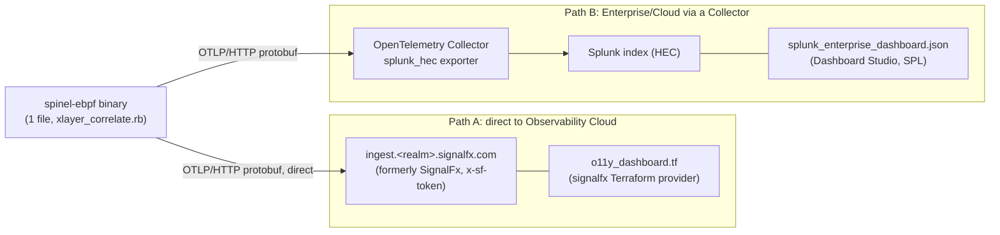

# Dashboard-as-code for Splunk (cross-layer L2 to L8 correlation)

A single spinel-ebpf binary emits **one record in which L3/L4, L7 and L8 sit
together** over OTLP. This directory holds the dashboard definitions
(dashboard-as-code) that display that record across layers in Splunk, together
with notes on how it looks and how to use it.

> **An honest caveat**: this repository has **not verified a connection to a real
> Splunk instance, nor the rendering** -- that needs an account, a realm and a
> token. What is here is a reproducible definition that *should* draw these
> charts, plus a document about how it looks. It is not evidence that it renders
> nicely in Splunk. What has been verified is three things: (a) the JSON is valid,
> (b) every attribute and metric name referenced **exists in spinel-ebpf**, so
> nothing charts an attribute that is never emitted, and (c) the environment
> variables for direct export match the ones the exporter actually reads.

## The two ingest paths and the file for each

There are two ways to get OTLP into Splunk, and each gets its own dashboard
format.



| Path | Destination | File | Dashboard technology |
|---|---|---|---|
| **A: direct to Observability Cloud** | `ingest.<realm>.signalfx.com`, the endpoint the `x-sf-token` header authenticates against | `o11y_dashboard.tf` | SignalFx Terraform provider (`signalfx_dashboard` and friends) + SignalFlow |
| **B: Enterprise/Cloud via a Collector** | Collector -> `splunk_hec` -> a Splunk index | `splunk_enterprise_dashboard.json` | Dashboard Studio JSON + SPL |

- Path A draws **metrics** (quantiles and counts of
  `http.server.request.duration`, plus `net.tcp.*`) in SignalFlow. Its selling
  point is that it needs no Collector.
- Path B accumulates **traces and logs (spans)** in an index and runs stats over
  arbitrary fields with SPL. It handles the high-cardinality attributes described
  below without difficulty.

## Attributes and metrics referenced (every key really exists)

The dashboards only reference keys that spinel-ebpf actually emits; nothing
charts an attribute that does not exist.

| Layer | Key | Type | Source |
|---|---|---|---|
| metric | `http.server.request.duration` | Float64 explicit-bucket Histogram (unit=s) | HTTP server span path |
| L3 | `client.address` | string | cross-layer span |
| L4 | `server.address` / `server.port` | string / int | cross-layer span |
| L4 | `net.tcp.established` / `net.tcp.state_changes` | int (keyed by 4-tuple) | cross-layer span (own keys) |
| L7 | `http.request.method` / `url.path` / `url.scheme` / `http.route` | string | HTTP server span |
| L7 | `http.response.status_code` | int | HTTP server span |
| L7 | span duration (latency) | — | span |
| L8 | `tenant` | string (from X-Tenant, or derived from the route) | cross-layer span |
| L8 | inherited W3C `traceparent` (traceId / parentSpanId) | — | HTTP server span |
| resource | `service.name` / `service.instance.id` / `telemetry.sdk.{name,language,version}` (+ `service.version`) | — | resource attributes on every signal |

The explicit bucket boundaries of `http.server.request.duration` are
`[0, 0.005, 0.01, 0.025, 0.05, 0.075, 0.1, 0.25, 0.5, 0.75, 1, 2.5, 5, 7.5, 10]`
in seconds, matching the OpenTelemetry eBPF instrumentation.

## Where to put an attribute, honestly

When sending OTLP to Splunk, **whether an attribute belongs on the metrics side or
on the traces/logs side** is decided by cardinality. Getting this wrong makes
Observability Cloud billing (the number of metric time series) and metric
cardinality explode.

| Cardinality | Examples | Where it goes | Why |
|---|---|---|---|
| **Low** | `http.route` / `http.request.method` / `http.response.status_code` | a dimension on **metrics** | the set of values is finite, which keeps the MTS count down and suits quantiles and rate aggregation |
| **High** | `client.address` / `tenant` (many of them) / the 4-tuple / `traceId` | on **traces / logs** | as a metric dimension these explode the MTS count and the bill. Keep them individually on spans and logs and search them when needed |

- On path A (Observability Cloud) it is reasonable to give
  `http.server.request.duration` the dimensions `http.route`, `method` and
  `status`. Avoid making `client.address`, or a large number of `tenant` values, a
  metric dimension; pick those up **on the trace side** instead.
- Path B (SPL) accumulates raw spans in an index, so high cardinality is fine to
  search -- at the usual trade-off against retention and storage.

## What the cross-layer join buys you

Traditional monitoring uses a different correlation key at each layer (NetFlow
uses the 4-tuple, APM uses traceId, application logs use user_id), so the layers
cannot be joined after the fact. spinel-ebpf puts **L3/L4, L7 and L8 in one record
(one span)**, so in Splunk you can **splitBy or filter on any axis with no join
across sources**.

For example:
- "slow routes where `tenant=acme` and `net.tcp.state_changes` is high", as **one
  filter**.
  - Path A: the `xlayer_tcp` chart splits by `tenant` and `http.route` and sits
    next to the duration chart.
  - Path B: the SPL behind `ds_xlayer_table` puts `state_changes`, `established`,
    `avg_duration` and `requests` in one table broken down by `tenant` and
    `http.route` (`splunk_enterprise_dashboard.json`).
- Dashboard filter variables for `tenant` and `http.route` exist in both formats.

This is not a reinvention of cross-layer eBPF correlation itself -- that is
Cilium/Hubble territory. What is specific to spinel-ebpf is the shape: **one
record that carries the correlation all the way up to L8, the application's
tenant, sent straight to an existing SaaS such as Splunk and drawn there.**

## Environment for direct export (path A)

Direct export to Observability Cloud works with the existing export settings and
needs no recompilation. **The endpoints and realms below are illustrative; this
repository does not connect to them.**

```sh
# Example of exporting directly to Splunk Observability Cloud (SignalFx)
export OTEL_EXPORTER_OTLP_HEADERS="x-sf-token=$SPLUNK_ACCESS_TOKEN"   # auth header
export OTEL_EXPORTER_OTLP_COMPRESSION=gzip                            # gzip compression

# Direct over HTTP: http://... in the clear, https://... over TLS via mbedTLS
./workload_self --instrument-otlp \
  https://ingest.us1.signalfx.com/v2/datapoint    # set <realm> and the path to your real endpoint

# For gRPC over TLS: grpcs://ingest.<realm>.signalfx.com:443
```

- Passing `https://` or `grpcs://` makes build_binary detect the scheme and link
  mbedTLS automatically. TLS verification uses the system CA store,
  `OTEL_EXPORTER_OTLP_CERTIFICATE`, or
  `OTEL_EXPORTER_OTLP_INSECURE_SKIP_VERIFY`.
- Use the real endpoint (`/v2/datapoint` and so on) and realm from your Splunk
  org. The above is only an example.

## Reading the access classification (`access_class`)

`access_classifier.rb` **classifies inbound traffic in place with XDP while a
burst is arriving** and sends the per-class rate as the `access_class` metric over
OTLP. Nothing is copied or mirrored; the counting happens directly at the kernel's
receive hook.

| Key | Type | Values | Source |
|---|---|---|---|
| metric | `access_class` | Sum (monotonic counter, the basis of the rate) | the classifier |
| dimension | `proto` | `icmp` / `udp` / `tcp` / `other` | XDP `pkt_l4_proto` |
| dimension | `tcp_state` | `syn` / `established` | the SYN/ACK bits from XDP `pkt_tcp_flags` |

`tcp_state=syn` means **SYN set and ACK clear, i.e. a new connection opening**,
while `established` covers connections already up (SYN-ACK, ACK, data, FIN, RST).
Separating the two lets you tell **a SYN surge (a spike in new connections)** from
**a rise in established traffic** -- the character of the burst, readable from one
chart.

- Path A (Observability Cloud): the `access_class` chart
  (`signalfx_time_chart.access_class` in `o11y_dashboard.tf`) is a ColumnChart
  split by `proto` and `tcp_state`.
- Path B (Enterprise/SPL): the `viz_access_class` panel, whose `ds_access_class`
  runs `mstats sum(_value) ... BY proto tcp_state`. The metric index (for example
  `otel_metrics`) depends on your ingest configuration.

**Cardinality discipline**: the dimensions of `access_class` are finite and fixed
(proto x tcp_state, at most 8 combinations), so they are safe on metrics.
**A high-cardinality dimension such as the source address (`src_ip`) must not
become a metric dimension** -- it explodes the MTS count and the bill. If you want
a per-source view, fold it into CIDR buckets or a top-N, or move it to
traces/logs, exactly as in the table above. The classifier deals only with the
L3/L4 proto and tcp_state.

## Reading enforcement (`action=pass|drop`)

`access_enforcer.rb` adds **blocking in place (XDP_DROP)** to that same
classification. Its static policy is **XDP_DROP for ICMP and XDP_PASS for
everything else (TCP/UDP/other)**, and it labels each classification series with
an `action` of `pass` or `drop`. That means **how much is being dropped and how
much is being passed can be told apart along the `action` dimension of the same
`access_class` metric** -- observation and enforcement from one binary.

| Key | Type | Values | Source |
|---|---|---|---|
| dimension | `action` | `pass` / `drop` | the XDP verdict: `XDP_DROP` for ICMP only, `XDP_PASS` for the rest |

- Path A (Observability Cloud): the `access_action` chart
  (`signalfx_time_chart.access_action` in `o11y_dashboard.tf`) splits
  `action=drop` and `action=pass` by proto.
- Path B (Enterprise/SPL): the `viz_access_action` panel, whose
  `ds_access_action` runs `mstats sum(_value) ... BY action proto`.

**Why only ICMP is dropped, for safety**: the enforcer's own OTLP export goes out
over **TCP** (HTTP or gRPC). Dropping TCP would kill its own telemetry. Dropping
UDP would take DNS and other traffic with it. An ICMP echo is harmless for a demo
and completely reversible -- exiting the enforcer cleanly runs the destructor,
which detaches the XDP program -- so the drop is restricted to ICMP. **The policy
is static**; making it drop dynamically above a threshold would need a
userspace-to-kernel channel and is a candidate extension.

## Honest limits

- **Rendering requires an account and a token.** It is unverified here: valid
  JSON, matching keys and consistent environment variables are as far as this
  goes.
- **Attributes outside semconv** (`net.tcp.established`, `net.tcp.state_changes`,
  `tenant`) can be filtered and split on, but **they do not appear automatically
  in Splunk's pre-built APM dashboards**. They have to be picked up explicitly by
  a hand-written dashboard like the ones here.
- **L5/L6 (TLS decryption) is out of scope.** The `https://` and `grpcs://` above
  refer to *our own egress being sent over TLS*, not to decrypting anyone else's
  traffic.
- **How reliable the Terraform is**: the SignalFlow in `o11y_dashboard.tf`
  (`histogram(...).percentile(...)`), the names of the variable blocks, and the
  derived histogram MTS (`.count` / `.sum`) all depend on the provider and the
  ingest version. The comment at the top of the file says so. `terraform validate`
  has not been run against it.
- **SPL field names**: how a dotted attribute (`http.route`, for instance) lands
  on HEC ingest depends on the `splunk_hec` exporter configuration in the
  Collector. Adjust the `index`, `sourcetype` and `duration` field names to your
  environment; the `_comment_*` entries in the JSON and the panel descriptions
  note this.

## Files

| File | Contents |
|---|---|
| `o11y_dashboard.tf` | Path A: Terraform definition for Splunk Observability Cloud (SignalFx) |
| `splunk_enterprise_dashboard.json` | Path B: Splunk Enterprise/Cloud Dashboard Studio (SPL) definition, valid JSON |
| `README.md` | This file |
